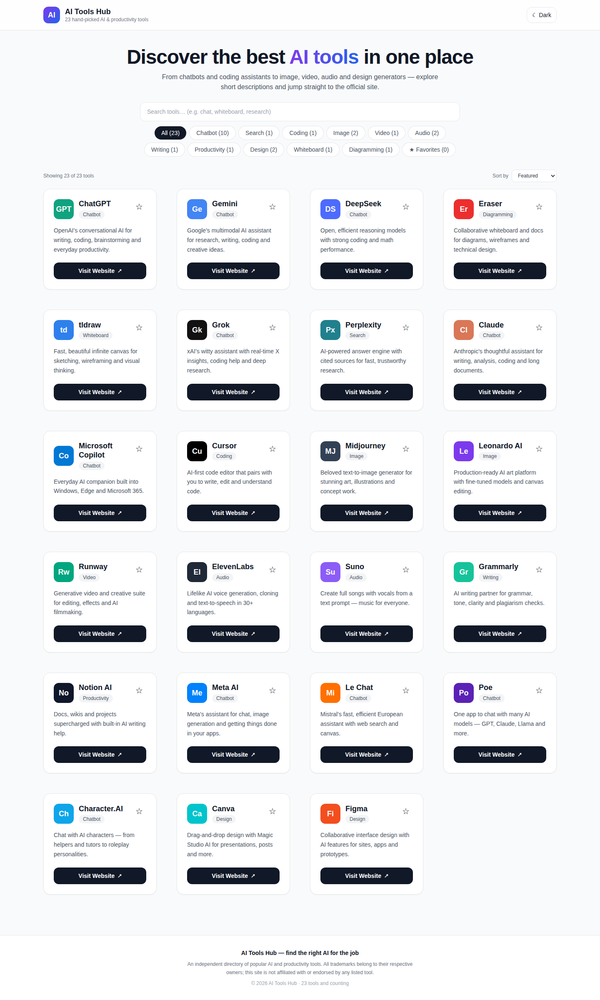
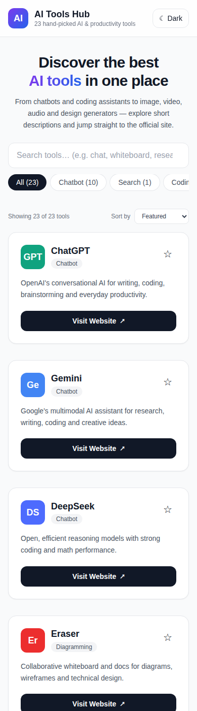

# AI Tools Hub 🚀

> A fast, accessible, responsive directory of the best AI & productivity tools — discover, filter, and jump straight to the official site.


---

## 📸 Preview

### Desktop



### Mobile



A clean, modern interface with a sticky header, hero search, category filters, and a responsive card grid (1 → 2 → 3 → 4 columns) with full light/dark mode support.

---

## ✨ Features

| Feature | Details |
| ------- | ------- |
| 🔍 **Live search** | Instant full-text filtering across tool names, descriptions, and categories |
| 🏷️ **Category filters** | 11 categories with live counts on every pill (e.g. `Chatbot (10)`) |
| ↕️ **Sorting** | Featured, Name A–Z / Z–A, or grouped by category |
| ⭐ **Favorites** | Star tools to build your own shortlist — persisted in `localStorage`, survives reloads |
| 🌙 **Dark mode** | Zero-flash theme init (applied before hydration), persisted preference, respects OS setting |
| 📱 **Fully responsive** | Mobile-first layout, `dvh` units for mobile browser chrome, 16px inputs (no iOS auto-zoom) |
| ♿ **Accessible** | `focus-visible` rings, ARIA labels/pressed/live regions, keyboard-navigable throughout |
| 🃏 **23 curated tools** | Chatbots, coding assistants, image / video / audio generators, design, whiteboards & more |

### 🧰 Tools included (23)

**Chatbots (10):** ChatGPT · Gemini · DeepSeek · Grok · Claude · Microsoft Copilot · Meta AI · Le Chat · Poe · Character.AI
**Coding (1):** Cursor · **Search (1):** Perplexity · **Image (2):** Midjourney · Leonardo AI
**Video (1):** Runway · **Audio (2):** ElevenLabs · Suno · **Writing (1):** Grammarly
**Productivity (1):** Notion AI · **Design (2):** Canva · Figma · **Whiteboard (1):** tldraw · **Diagramming (1):** Eraser

---

## 🛠️ Tech Stack

| Technology | Version | Purpose |
| ---------- | ------- | ------- |
| Next.js (App Router) | 14 | Framework, static prerendering, routing |
| React | 18 | UI components |
| TypeScript (`strict`) | 5 | Type safety |
| Tailwind CSS | 3.4 | Utility-first styling, dark mode |
| ESLint (`next/core-web-vitals`) | 8 | Linting — zero warnings |
| **Runtime dependencies** | **Zero** | No third-party UI/icon libraries — all icons are inline SVG/CSS |

---

## 🏗️ Project Structure

```
src/
├── app/
│   ├── page.tsx          # Homepage — search, filters, sorting, tool grid
│   ├── layout.tsx        # Metadata, viewport, pre-hydration theme script
│   ├── error.tsx         # Route error boundary with retry
│   ├── icon.svg          # Auto-served favicon
│   └── globals.css       # Tailwind + CSS-variable theming
├── components/
│   ├── ToolCard.tsx      # Tool card: badge, name, category, description, link
│   └── ToolIcon.tsx      # Brand-colored badges (no external images)
└── data/
    └── tools.ts          # Single source of truth — the tool catalog
```

---

## 🔒 Security Highlights

- **Allowlisted URLs only** — every external link comes from the fixed catalog in `src/data/tools.ts`; no user input ever becomes a link or HTML (React auto-escapes all rendered text).
- **Reverse-tabnabbing protection** — all `target="_blank"` links carry `rel="noopener noreferrer"`.
- **Hardened headers** in `next.config.mjs` — `Strict-Transport-Security`, `X-Frame-Options: DENY`, `X-Content-Type-Options: nosniff`, `Referrer-Policy: strict-origin-when-cross-origin`.
- **Crash-proof persistence** — `localStorage` reads are validated (JSON + type + allowlist checks) and writes are guarded for private-mode/quota failures.
- **Zero secrets** — no API keys or credentials anywhere; safe to run, fork, and deploy publicly.

---

## ⚡ Performance & Quality Notes

- **~92 kB first-load JS**, fully static-prerendered homepage.
- No external fonts, images, analytics, or icon CDNs — zero third-party requests.
- `next lint` passes with no warnings; `next build` passes cleanly.
- Full production build + runtime smoke test (HTTP 200, security headers verified) before every release.

---

## 🚀 Getting Started

**Prerequisites:** Node.js 18+ and npm.

```bash
# Install dependencies
npm install

# Start the dev server
npm run dev
```

Open [http://localhost:3000](http://localhost:3000) in your browser.

| Command | Description |
| ------- | ----------- |
| `npm run dev` | Start the development server |
| `npm run build` | Create an optimized production build |
| `npm run start` | Serve the production build |
| `npm run lint` | Run ESLint |

---

## ➕ Adding a Tool

Add one entry to the `TOOLS` array in `src/data/tools.ts` — counts, filters, and search pick it up automatically:

```ts
{
  id: "my-tool",            // unique, lowercase, no spaces
  name: "My Tool",
  description: "What it does, in one line.",
  url: "https://example.com", // https:// only, official site
  category: "Chatbot",      // must match a ToolCategory
  brandColor: "#7C3AED",
  initials: "MT",           // 1–3 characters for the badge
}
```

If it's a brand-new category, also add it to the `ToolCategory` type and the `CATEGORIES` array in the same file.

---

## 🗺️ Roadmap

- [ ] Tool detail modals (features, pricing tier, best-for tags)
- [ ] "Suggest a tool" submission form
- [ ] Compare-tools view (side-by-side)
- [ ] PWA support (installable, offline catalog)
- [ ] Deploy live demo (Vercel)

---

## 👨‍💻 Author

**Pratik Kamble** — DevOps Engineer

- GitHub: [@pratikkamble14](https://github.com/pratikkamble14)
- LinkedIn: [pratik-kamble-9995b0260](https://www.linkedin.com/in/pratik-kamble-9995b0260)
- Portfolio: [pratikkamble14.github.io/pratik-kamble-portfolio](https://pratikkamble14.github.io/pratik-kamble-portfolio/)
- Email: [kamblepratik1404@gmail.com](mailto:kamblepratik1404@gmail.com)

_Open to DevOps / cloud opportunities — feel free to reach out!_

---

## 📄 License

This project is licensed under the MIT License — see the [LICENSE](LICENSE) file for details.

## ⚖️ Disclaimer

An independent directory. All trademarks belong to their respective owners; this project is not affiliated with or endorsed by any listed tool.
